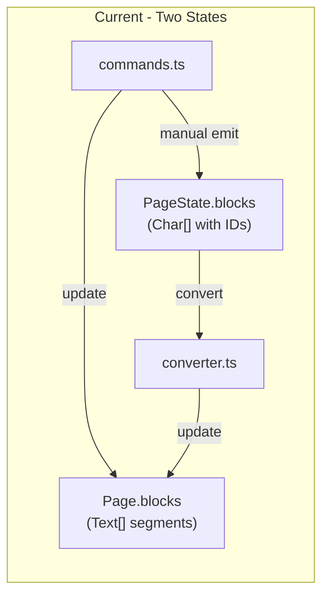
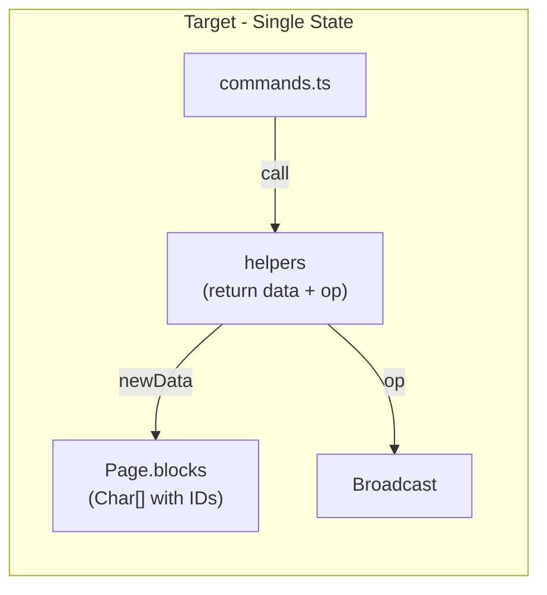

# CRDT-Native Editor Refactoring Plan (Minimal Changes)

## Problem Analysis

Current dual-state architecture:



**Problems:**

- 55+ manual `syncBinding.emit*()` calls in commands.ts
- States can diverge (convergence issues)
- Performance overhead from constant conversion

## Target Architecture



**Key insight:** Make `Block.content` use `Char[]` (with IDs) instead of `Text[]`. Helpers return BOTH the new data AND the CRDT operation atomically - impossible for them to diverge.

## Detailed Changes

### Phase 1: Make Block Types CRDT-Native

**File:** `apps/web/src/deserializer/loadPage.ts`

Change text content from segment-based to character-based:

```typescript
// BEFORE:
export interface Text {
  content: string;
  formats?: TextFormat[];
}

export interface Paragraph extends BlockRuntimeState {
  id: string;
  type: "paragraph";
  content: Text[];  // Segment-based
}

// AFTER:
export interface Char {
  id: string;        // Unique ID: "peerId:counter"
  char: string;      // Single character
  deleted?: boolean; // Tombstone flag
}

export interface FormatSpan {
  startCharId: string;
  endCharId: string;
  format: TextFormat;
  clock: number;     // For LWW conflict resolution
}

export interface Paragraph extends BlockRuntimeState {
  id: string;
  type: "paragraph";
  chars: Char[];           // Character-based (CRDT native)
  formats: FormatSpan[];   // Format spans reference char IDs
}
```

The `Block` type now holds CRDT data directly - no conversion needed.

### Phase 2: Create CRDT Helper Functions

**New file:** `apps/web/src/editor/crdt-helpers.ts`

Helpers return BOTH new data AND the CRDT operation atomically:

```typescript
import type { Char, FormatSpan } from "../deserializer/loadPage";
import type { TextInsert, TextDelete, FormatSet, HLC } from "../sync/types";

interface InsertResult {
  newChars: Char[];
  op: TextInsert;
}

interface DeleteResult {
  newChars: Char[];
  op: TextDelete;
}

// Insert text - returns new chars AND the operation
export function insertCharsAtPosition(
  chars: Char[],
  position: number,
  text: string,
  blockId: string,
  idGen: () => string,
  clock: HLC
): InsertResult {
  // Find the char ID to insert after
  const afterCharId = findCharIdAtPosition(chars, position);
  
  // Generate new chars with IDs
  const newCharObjects: Char[] = Array.from(text).map(char => ({
    id: idGen(),
    char,
    deleted: false,
  }));
  
  // Find insert index in full array (accounting for tombstones)
  const insertIndex = findInsertIndex(chars, position);
  
  // Create new chars array
  const newChars = [...chars];
  newChars.splice(insertIndex, 0, ...newCharObjects);
  
  // Create operation
  const op: TextInsert = {
    op: "text_insert",
    id: idGen(),
    clock,
    pageId: "", // filled by caller
    blockId,
    afterCharId,
    chars: newCharObjects.map(c => ({ id: c.id, char: c.char })),
  };
  
  return { newChars, op };
}

// Delete text - returns new chars AND the operation
export function deleteCharsInRange(
  chars: Char[],
  startIndex: number,
  endIndex: number,
  blockId: string,
  idGen: () => string,
  clock: HLC
): DeleteResult {
  const deletedIds: string[] = [];
  let visibleCount = 0;
  
  const newChars = chars.map(char => {
    if (!char.deleted) {
      if (visibleCount >= startIndex && visibleCount < endIndex) {
        deletedIds.push(char.id);
        return { ...char, deleted: true };
      }
      visibleCount++;
    }
    return char;
  });
  
  const op: TextDelete = {
    op: "text_delete",
    id: idGen(),
    clock,
    pageId: "",
    blockId,
    charIds: deletedIds,
  };
  
  return { newChars, op };
}

// Helper: find char ID at visible position (for afterCharId)
function findCharIdAtPosition(chars: Char[], position: number): string | null {
  if (position === 0) return null;
  
  let visibleCount = 0;
  for (const char of chars) {
    if (!char.deleted) {
      visibleCount++;
      if (visibleCount === position) {
        return char.id;
      }
    }
  }
  return null;
}

// Helper: find insert index in full array
function findInsertIndex(chars: Char[], visiblePosition: number): number {
  let visibleCount = 0;
  for (let i = 0; i < chars.length; i++) {
    if (!chars[i].deleted) {
      if (visibleCount === visiblePosition) return i;
      visibleCount++;
    }
  }
  return chars.length;
}
```

**Read-only helpers** (no ops needed):

```typescript
// Get visible text (skip deleted chars)
export function getVisibleText(chars: Char[]): string {
  return chars.filter(c => !c.deleted).map(c => c.char).join("");
}

// Get visible char count
export function getVisibleLength(chars: Char[]): number {
  return chars.filter(c => !c.deleted).length;
}
```

### Phase 3: Update Commands to Return { state, ops }

**File:** `apps/web/src/editor/commands.ts`

Commands use the new helpers and return both state AND ops:

```typescript
// Define result type for all commands
export interface CommandResult {
  state: EditorState;
  ops: Operation[];
}

// BEFORE:
export function insertTextAtCursor(state: EditorState, input: string): EditorState {
  const syncBinding = getSyncBinding();
  // ... complex block manipulation ...
  if (syncBinding && blockId) {
    syncBinding.emitTextInsert(blockId, textIndex, input);
  }
  return newState;
}

// AFTER:
export function insertTextAtCursor(state: EditorState, input: string): CommandResult {
  const { blockIndex, textIndex } = state.document.cursor.position;
  const block = state.document.page.blocks[blockIndex];
  
  // Helper returns BOTH new data AND the operation
  const { newChars, op } = insertCharsAtPosition(
    block.chars,
    textIndex,
    input,
    block.id,
    state.idGen,
    state.clock()
  );
  
  const newState = {
    ...state,
    document: {
      ...state.document,
      page: {
        ...state.document.page,
        blocks: replaceBlock(state.document.page.blocks, blockIndex, {
          ...block,
          chars: newChars,
        }),
      },
      cursor: {
        ...state.document.cursor,
        position: { blockIndex, textIndex: textIndex + input.length },
      },
    },
  };
  
  return { state: newState, ops: [op] };
}

// Complex commands compose multiple helpers
export function deleteSelection(state: EditorState): CommandResult {
  const ops: Operation[] = [];
  
  // ... determine what to delete ...
  
  // Each helper call adds to ops
  const { newChars, op: deleteOp } = deleteCharsInRange(...);
  ops.push(deleteOp);
  
  // Maybe also need block operations
  if (needsMerge) {
    const { newBlocks, op: mergeOp } = mergeBlocks(...);
    ops.push(mergeOp);
  }
  
  return { state: newState, ops };
}
```

**Key pattern:** Commands collect ops from all helper calls into an array.

### Phase 4: Add Broadcast Layer

**File:** `apps/web/src/editor/editor.ts`

Add a wrapper that broadcasts ops after each command:

```typescript
// Command executor that handles broadcasting
function executeCommand<T extends any[]>(
  command: (state: EditorState, ...args: T) => CommandResult,
  ...args: T
): void {
  const { state: newState, ops } = command(state, ...args);
  
  // Update local state
  state = newState;
  
  // Broadcast ops to peers (if any)
  if (ops.length > 0 && broadcastFn) {
    broadcastFn(ops);
  }
  
  // Trigger re-render
  scheduleRender();
  notifyListeners(state);
}

// Usage in event handlers:
function handleKeyDown(e: KeyboardEvent) {
  if (e.key === "Backspace") {
    executeCommand(handleBackspace);
  } else if (isPrintable(e.key)) {
    executeCommand(insertTextAtCursor, e.key);
  }
  // ...
}
```

**Alternative: Middleware pattern** for cleaner separation:

```typescript
type CommandFn = (state: EditorState, ...args: any[]) => CommandResult;

function withBroadcast(command: CommandFn): CommandFn {
  return (state, ...args) => {
    const result = command(state, ...args);
    if (result.ops.length > 0) {
      broadcast(result.ops);
    }
    return result;
  };
}
```

### Phase 5: Cleanup

**Delete:**

- `apps/web/src/sync/binding.ts` - No longer needed
- `apps/web/src/sync/converter.ts` - No longer needed (Page IS CRDT state)

**Simplify:**

- `apps/web/src/sync/index.ts` - SyncEngine only handles remote ops
- `apps/web/src/editor/state.ts` - Remove `getSyncBinding()` / `setSyncBinding()`

## Rendering Considerations

The renderer needs to compute visible text from `Char[]`:

```typescript
// In renderer, get text for display
const text = block.chars.filter(c => !c.deleted).map(c => c.char).join("");

// Get format at position - resolve from FormatSpan[]
const formats = getFormatsAtPosition(block.formats, block.chars, position);
```

This can be memoized per-block for performance.

## Key Benefits

1. **Single source of truth** - `Page.blocks` IS the CRDT state
2. **Atomic correctness** - Helpers return data + op together, impossible to diverge
3. **No expensive diffing** - Ops generated at source, not derived from comparison
4. **Better convergence** - Data and ops always match by construction
5. **Simpler architecture** - Remove binding/converter layers
6. **Composable** - Complex commands collect ops from multiple helper calls

## Migration Strategy

No need for backward compabitbiltiy